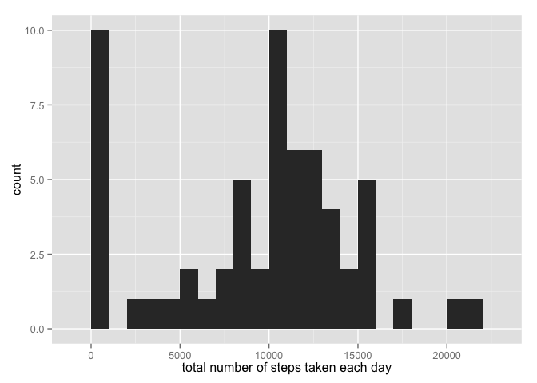
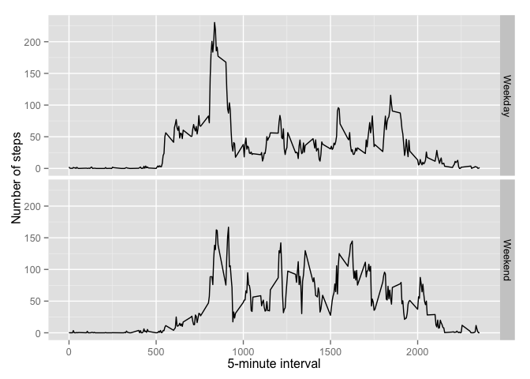

# Reproducible Research: Peer Assessment 1


## Loading and preprocessing the data

### Load the data (i.e. read.csv())

```r
unzip(zipfile="activity.zip")
data <- read.csv("activity.csv")
```

## What is mean total number of steps taken per day?


```r
library(ggplot2)
steps <- tapply(data$steps, data$date, FUN=sum, na.rm=TRUE)
qplot(steps, binwidth=1000, xlab="total number of steps taken each day")
```

 

```r
mean(steps, na.rm=TRUE)
```

```
## [1] 9354.23
```

```r
median(steps, na.rm=TRUE)
```

```
## [1] 10395
```


## What is the average daily activity pattern?


```r
library(ggplot2)
averages <- aggregate(x=list(steps=data$steps), by=list(interval=data$interval), FUN=mean, na.rm=TRUE)
ggplot(data=averages, aes(x=interval, y=steps)) +
    geom_line() +
    xlab("5-minute interval") +
    ylab("average number of steps taken")
```

 

### Which 5-minute interval, on average across all the days in the dataset, contains the maximum number of steps?


```r
averages$interval[which.max(averages$steps)]
```

```
## [1] 835
```

## Imputing missing values

### Calculate and report the total number of missing values in the dataset (i.e. the total number of rows with NAs)


```r
missing <- is.na(data$steps)
# How many missing
table(missing)
```

```
## missing
## FALSE  TRUE 
## 15264  2304
```

### Devise a strategy for filling in all of the missing values in the dataset.


```r
# Replace each missing value with the mean value of its 5-minute interval
fill.value <- function(steps, interval) {
    filled <- NA
    if (!is.na(steps))
        filled <- c(steps)
    else
        filled <- (averages[averages$interval==interval, "steps"])
    return(filled)
}
```

### Create a new dataset that is equal to the original dataset but with the missing data filled in.

```r
filled.data <- data
filled.data$steps <- mapply(fill.value, filled.data$steps, filled.data$interval)
```

### Make a histogram of the total number of steps taken each day and Calculate and report the mean and median total number of steps taken per day. 


```r
total.steps <- tapply(filled.data$steps, filled.data$date, FUN=sum)
qplot(total.steps, binwidth=1000, xlab="total number of steps taken each day")
```

 

```r
mean(total.steps)
```

```
## [1] 10766.19
```

```r
median(total.steps)
```

```
## [1] 10766.19
```

### Do these values differ from the estimates from the first part of the assignment? 

Yes.

### What is the impact of imputing missing data on the estimates of the total daily number of steps?

The mean and average number of steps taken per day become larger. There are far less days with zero steps taken.


## Are there differences in activity patterns between weekdays and weekends?


```r
Sys.setlocale("LC_TIME", "en_US")
```

```
## [1] "en_US"
```

```r
filled.data$date <- as.Date(filled.data$date)
filled.data$weekend <- weekdays(filled.data$date) %in% c('Saturday', 'Sunday')

averages <- aggregate(steps ~ interval + weekend, data=filled.data, mean)

averages$weekend = as.factor(averages$weekend)
levels(averages$weekend) = c("Weekday", "Weekend")

library(ggplot2)
ggplot(averages, aes(interval, steps)) + geom_line() + facet_grid(weekend ~ .) +
    xlab("5-minute interval") + ylab("Number of steps")
```

 
